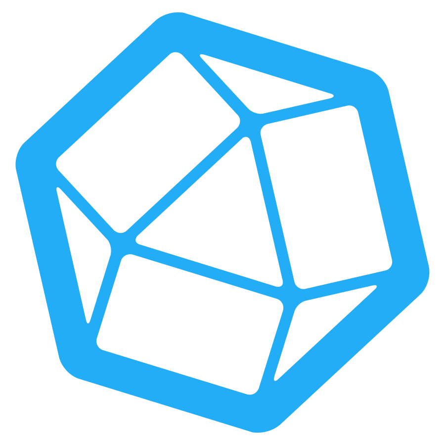

<h1 align="center">✌️ Hola, Soy Emmanuel Ramírez Romero</h1>

  🚀 Ciencia de Datos | Python • ML • Automatización • Power BI  
  🎓 Profesional en Mecatrónica y en Sistemas Computacionales | Ubicado en Almoloya, Hidalgo 🇲🇽

---

## 🧑‍💻 Sobre mí

• 🚀 Soy **Científico de Datos**, enfocado en aplicaciones reales  
• 🎓 Estudié **Ingeniería en Mecatrónica** y **Maestría en Sistemas Computacionales**  
• 🤖 Conecto **Sistemas IT/OT**, trabajando con datos de PLCs, sensores y dashboards  
• 📈 Actualmente estoy aprendiendo ML avanzado, despliegue de modelos y analítica en tiempo real  
• 💬 Pregúntame sobre Python, Dashboards, Analítica predictiva, Limpieza de datos, Visión por Computadora, Inteligencia Artificial  
• 📫 Contáctame: [LinkedIn](https://linkedin.com/in/emmanuel-data-science) • emmanuel.mec@gmail.com  

---

## 🧰 Tecnologías

### 🧠 Lenguajes, Bases de Datos y Ciencia de Datos

   |
   |
   |
   |
   |
   |
   |
   |
  

--

### 📊 Visualización y Dashboards

   |
   |
   |
   |
   |
   |
  

--

### 🔌 Automatización, IoT y Desarrollo para la industria

 |
   |
   |
  

---

## 📈 Estadísticas de GitHub

  
  

---

## 💡 Intereses

Me apasiona especialmente aplicar la ciencia de datos en:

- 📈 **Optimización de negocios con IA**
- 🌐 **Dashboards en tiempo real e integración IT/OT**
- 📟 **Analítica de sensores**
- 🔧 **Operaciones industriales**
- 🔍 **Mantenimiento predictivo**

¡Gracias por tu visita! Creemos sistemas basados en datos que realmente se conecten con el mundo real ⚙️📊

